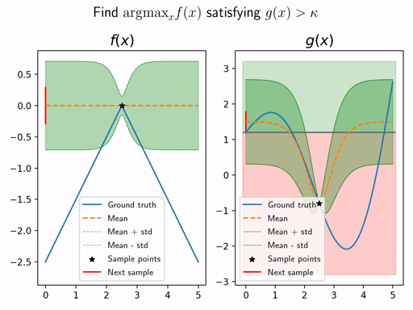

# ProbabilisticAI-Projects
This repository contains the four course projects for the course *Probabilistic Artificial Intelligence (Fall 2020)* held at ETH Zürich by Prof. Krause.
The projects include Gaussian Processes and Bayesian Optimization, Bayesian Neural Networks (using Bayes by Backprop) and Reinforcement Learning (Actor-Critic algorithm).
A short overview of the results of each project is presented in this document.

### Contents
- [ProbabilisticAI-Projects](#probabilisticai-projects)
    - [Contents](#contents)
  - [Project 1 - Gaussian Process Classification with costly false negatives](#project-1---gaussian-process-classification-with-costly-false-negatives)
  - [Project 2 - Well calibrated Bayesian Neural Network](#project-2---well-calibrated-bayesian-neural-network)
  - [Project 3 - Constrained Bayesian Optimization](#project-3---constrained-bayesian-optimization)
  - [Project 4 - Reinforcement Learning using Actor-Critic-Method](#project-4---reinforcement-learning-using-actor-critic-method)

## Project 1 - Gaussian Process Classification with costly false negatives

This project is mostly about classifying two-dimensional datapoints given a dataset.
Since the dataset is rather large, computing the inverse of the kernel matrix is impossible and a workaround has to be found.
We implemented the Nystrom method, essentially using a subset of the data and using the Schur-Complement to efficiently compute the inverse matrix.

## Project 2 - Well calibrated Bayesian Neural Network

In this project, the goal was to create a ''well calibrated'' neural network classifier, i.e. a NN for which the class prediction probabilities actually match up with the frequency of ground truth label (e.g. if a two-class problem as probabilities $p_A = 0.9$ and $p_B = 0.1$, the true label is going to be $A$ roughly $90\%$ of the time).
For more information, check [Guo, C., Pleiss, G., Sun, Y. and Weinberger, K.Q., 2017, July. On calibration of modern neural networks.](http://proceedings.mlr.press/v70/guo17a/guo17a.pdf)

**MNIST dataset**

**Fashion MNIST dataaset**

We approached the problem using Bayesian Neural Networks with a gaussian prior around $0$ for all the weights, and train it using the Bayes-by-Backprop algorithm, which we implemented ourselves.

## Project 3 - Constrained Bayesian Optimization

Here, the goal is maximizing an unknown function $f$ by drawing noisy samples and additionally satisfying an unknown inequality constraint $g(x) > \kappa$.
We use Gaussian Processes (GPs) to model each function and sample accoding to the Upper-Confidence-Bound method.
The objective function is penalized if the lower confidence bound of the constraint estimate is below $\kappa$, thus providing constraint satisfaction with high probability.

Mathematical / Implementation details

Assuming we can draw a noisy sample $\hat{f}(x) = f(x) + \epsilon$, $\epsilon \sim \mathcal{N}(0, \sigma^2)$ for each function, the GP equations read
$$
\mu'(x) = \mu(x) + k_{x,A}(K_{AA} + \sigma^2 I )^{-1}(y_A - \mu_A)
$$

$$
k'(x, x') = k(x, x') - k_{x,A}(K_{AA} + \sigma^2 I )^{-1}k_{x',A}^T
$$

where $A = \{x_1, \dots, x_N\}$ denotes the previously drawn samples.

Note the matrix inverse $M^{-1} = (K_{AA} + \sigma^2I)^{-1}$, which has to be repeatedly calculated as $A$ grows.
We can make use of the fact that the uninverted matrix gets updated by adding columns and rows in a blockwise manner.
Thus, we can use a Schur-Complement approach ([see Eq. (1)](https://en.wikipedia.org/wiki/Invertible_matrix#Blockwise_inversion)) to iteratively and efficiently compute the matrix inverse after each new sample.

Unfortunately, the result does turn out not to be numerically stable if applied a large number of times. Thus, we additionally apply a few steps of an iterative refinement scheme after each inversion, increasing the precision of the inverse (see *Wu, X. and Wu, J., 2009. Iterative refinement of computing inverse matrix.*), i.e.
$$
M \leftarrow M(I+(I - MM^{-1} )).
$$
Note that this update step can be derived from minimizing the error $err(M) = ||I - MM^{-1}||_2^2$ using a simple Newton-Algorithm.

To our knowledge, these two methods have not previously been combined in this way in the context of GPs and Bayesian Optimization.

## Project 4 - Reinforcement Learning using Actor-Critic-Method

In this project we implement a general Actor-Critic Agent and apply it on the LunarLander gym environment.
We use a simple MLP for both the Actor and the Critic, a trajectory storage buffer and the Policy-Gradient algorithm to train the networks.
After about 110 iterations our agent converges to a reasonable result (see video).

